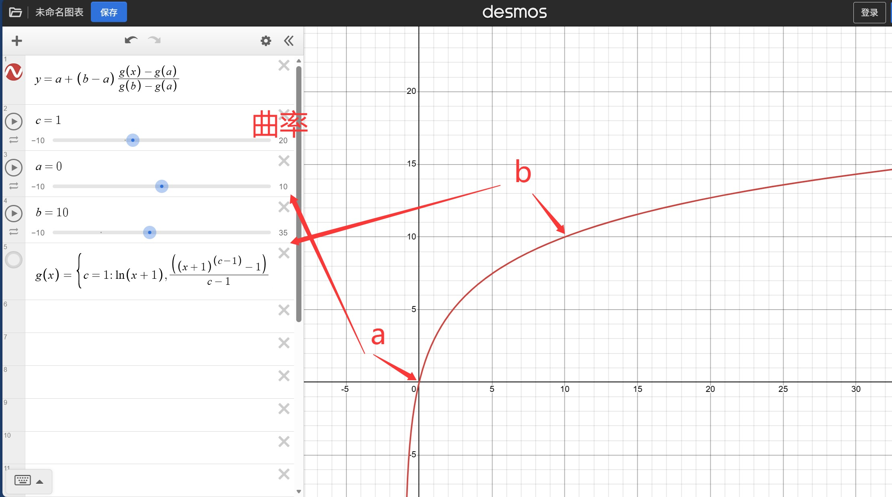
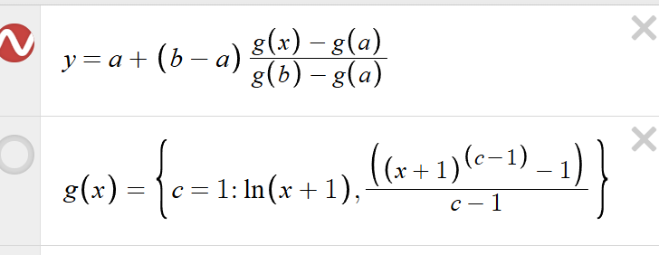
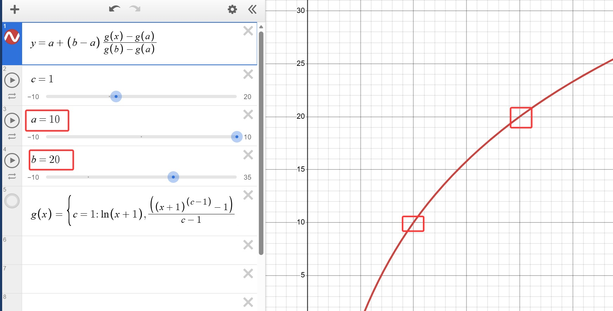
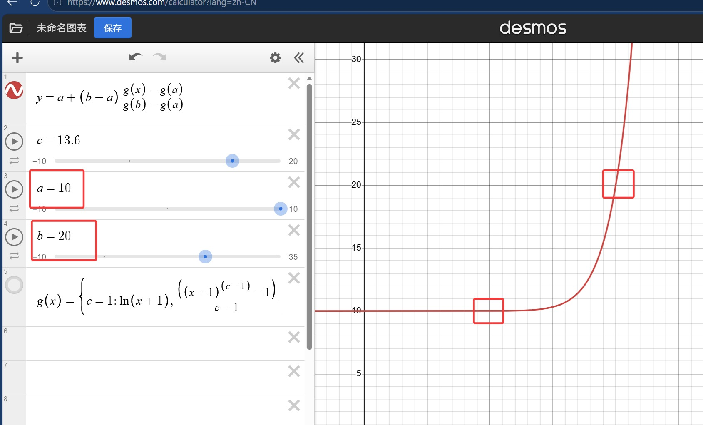
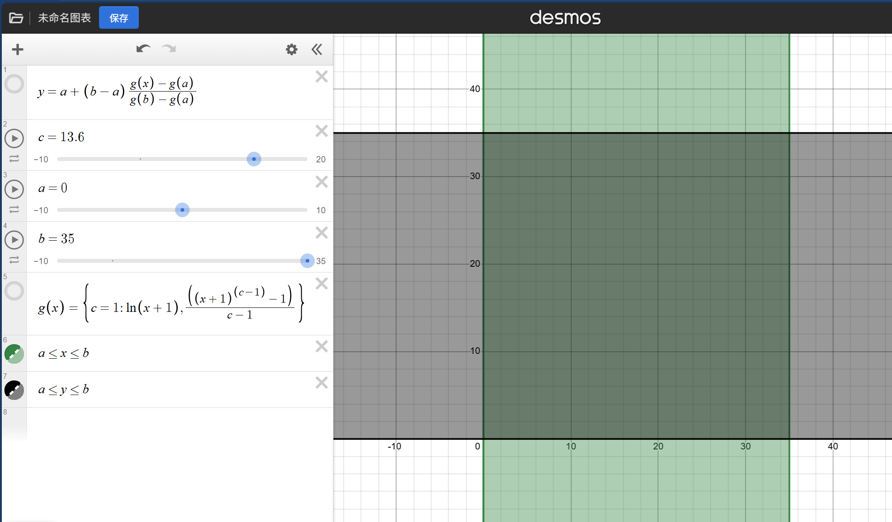
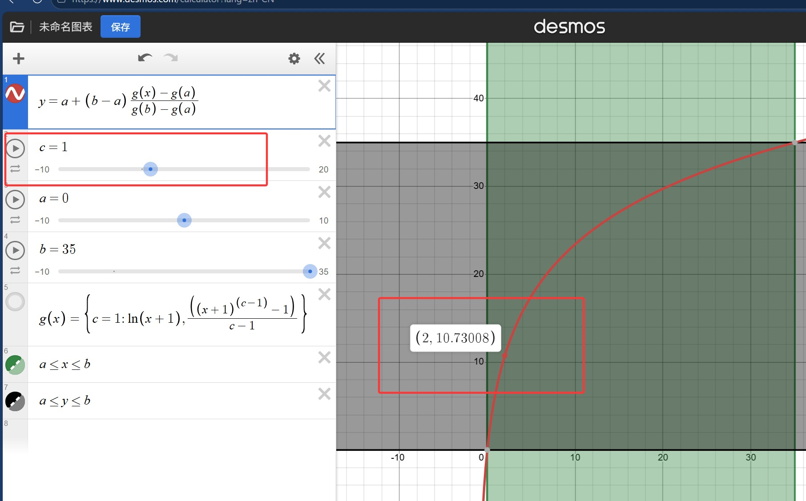
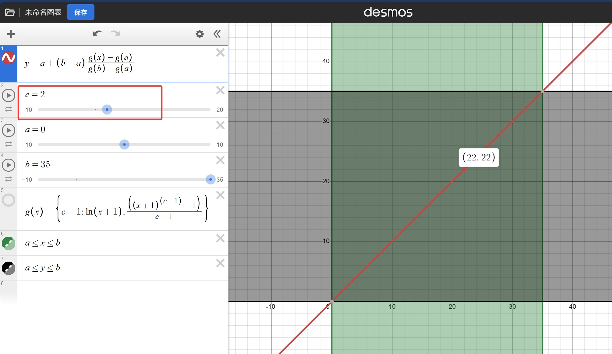
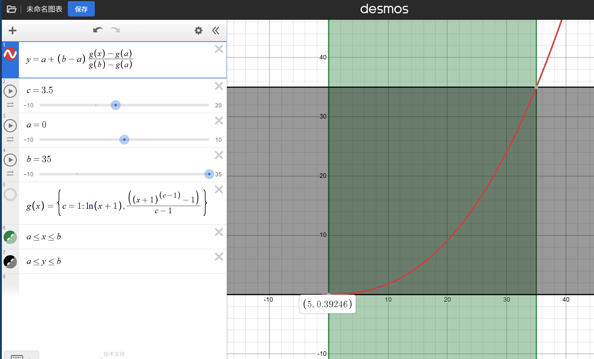

# One Enough Math Damage

**优雅的数值重塑模组 —— 用数学统一伤害配置，告别盲调倍率**

---

## 简介

在高度模组化的 Minecraft 整合包中，不同 Mod 的生物伤害数值差异巨大，硬编码的伤害值让全局平衡几乎不可能。  
**One Enough Math Damage** 提供了一套 **数据包驱动、数学严谨、可热重载** 的伤害映射系统，让你通过简单的 JSON 配置，就能将任何生物的任意伤害值，精准地重塑到你计算出的标准区间内，同时保留原模组的技能分化，或按你的意愿主动扭曲伤害分布。

---

## 特性

- **数据包配置**：所有映射规则放在数据包的 `entity_damage` 文件夹中，无需编写代码。
- **三种映射模式**：
    - `linear` —— 线性缩放，保留原始伤害比例。
    - `nonlinear` —— 统一非线性曲线，一个曲率参数连续控制上凸（对数感）到线性再到下凸（指数感），甚至极端阶梯效果。
    - `piecewise` —— 分段线性，用节点自定义任意凸凹形状，可制造突变拐点。
- **原生区间 + 目标区间**：用固定观察窗口（如 `[0,15]`）统一衡量不同模组的技能，强伤害自动外推突破标准值，小伤害能被曲线拉高。
- **钳制控制**：可分别选择是否将原始伤害限制在原生区间、是否将最终伤害限制在目标区间。
- **热重载**：在游戏中修改 JSON 后，使用 `/reload` 即可立即生效，无需重启。
- **调试模式**：开启后，玩家受伤时聊天框会显示原始伤害和映射后伤害，平衡调试一目了然。
- **轻量且专注**：仅介入伤害计算，不添加额外游戏内容，性能友好。

---

## 安装

1. 下载与本模组兼容的 Minecraft 版本（Forge 1.20.1）的 Jar 文件。
2. 放入 `.minecraft/mods` 文件夹。
3. 启动游戏，模组会自动生成默认配置文件。

---

## 配置方式

### 1. 数据包结构

在任意数据包创建以下路径：<br>

```
data/<命名空间>/entity_damage/<任意名称>.json
```


模组会扫描所有命名空间下的 `entity_damage` 文件夹及其子文件夹中的所有 JSON 文件。

### 2. JSON 配置格式

```json
//线性方法映射
{
  "entity": "bosses:fire_lord",
  "standard_range": [0, 15],
  "target_range": [0, 35],
  "function": "linear",
  "curvature": 1.5, //此项代码自动忽略
  "clamp_source_min": true,
  "clamp_source_max": false,
  "clamp_target_min": true,
  "clamp_target_max": true
}
```
```json
//非线性方法映射
{
  "entity": "bosses:fire_lord",
  "standard_range": [0, 15],
  "target_range": [0, 35],
  "function": "nonlinear",
  "curvature": 1.5,
  "clamp_source_min": true,
  "clamp_source_max": false,
  "clamp_target_min": true,
  "clamp_target_max": true
}
```
```json
//分段式线性方法映射
{
  "entity": "bosses:shadow_boss",
  "standard_range": [0, 18],
  "target_range": [0, 45],
  "function": "piecewise",
  "nodes": [
    [0.0, 0.0],
    [0.2, 0.5], //表示从0%到20%的原伤害，映射到目标区间的50%
    [0.6, 0.85],
    [1.0, 1.0]
  ],
  "clamp_source_min": true,
  "clamp_source_max": false,
  "clamp_target_min": true,
  "clamp_target_max": true
}
```

### 字段说明

| 字段	               |类型|                                             	说明                                              |
|:------------------|-----:|:--------------------------------------------------------------------------------------------:|
| entity            |	string	|                                必须。生物的注册名，如 minecraft:zombie。                                 
| standard_range    |	[min, max]	|                       必须。原生观察区间。通常下限填 0，上限是你根据大量模组经验确定的“普通技能”阈值，如 15。                        |
| target_range      |	[min, max]	|                        必须。映射后的目标伤害区间。下限通常为 0，上限为你为该生物计算出的标准伤害值（如 35）。                        |
| function	         |string	|                            必须。映射函数类型：linear、nonlinear、piecewise。                             |
| curvature	        |number	|    曲率参数，仅 nonlinear 时使用。c=1 为对数压缩，c=2 为线性，c>2 为指数拉伸，c<1 越偏离线性凸凹越强。c=-10 等负值会制造“一刀切”阶梯效果。     |
| nodes             |	array	| 分段节点，仅 piecewise 时使用。格式为 [[x1,y1], [x2,y2], ...]，x 必须在 [0,1] 内并严格递增，首节点 x 必须为 0，末节点 x 必须为 1。 |
| clamp_source_min  |	boolean	|                        是否将原始伤害下限钳制在 standard_range 内。默认为 false（允许外推）。                        |
| clamp_source_max  |	boolean	|                        是否将原始伤害上限钳制在 standard_range 内。默认为 false（允许外推）。                        |
| clamp_target_min	 |boolean	|                            是否将映射后伤害下限钳制在 target_range 内。默认为 false                            |
| clamp_target_max	 |boolean	|                            是否将映射后伤害上限钳制在 target_range 内。默认为 false                            |

### 3.映射逻辑简述
首先我们有一个参考区间：

这就是 standard_range，比如 [0, 15]。所有 BOSS 的攻击落在哪里，我们都用这把统一的尺子去量一量。

然后我们设定另一个区间，它是被期望的值：<b>我们期望伤害变成什么样</b>。也就是target_range，比如[0, 35]。

#### 映射过程就像是把尺子上的读数，按规则转移到标尺上：

#### 第一步：量伤害
BOSS 打出了 7 点伤害，在我们的“0~15 尺子”上，它位于 7/15 的位置。我们用同样的比例在“0~35 标尺”上找到对应的原始位置：7/15 × 35 ≈ 16.3。这个位置叫做 X。

#### 第二步：归一化

为了方便操作，我们把 X 再换算成标尺上的“进度百分比” t：t = X / 35。对于刚才的 16.3，t 就是 0.466（差不多一半）。
#### 第三步：用函数“捏”一下这个百分比

根据你选择的 function，这个百分比 t 会被重新塑造：

* 选 linear：什么都不变，t 还是原来的 t。技能原来多强就等比缩放，手感保持一致。

* 选 nonlinear：这里就像捏橡皮泥。curvature（曲率）控制着“捏”的方向和力度。

* * 曲率 = 2 时，等于没捏（线性）。
* * 曲率 < 2 时，把小数值（轻攻击）往上拉，把大数值（重击）往下压——让平砍更有存在感，让秒杀技变温和。

* * 曲率 > 2 时反过来，轻的变更轻，重的变更重，增加被秒的恐惧感。
甚至可以用负曲率，让超过一定门槛的攻击直接飙到最大值。

* 选 piecewise：你可以手动指定几个“折点”，让伤害在某些区间猛涨、某些区间平缓，造出极具个性的伤害曲线。

#### 第四步：映射回真实伤害
被“捏”好的百分比 mappedT，再乘上标尺范围（tgtMax - tgtMin），加上下限，就是最终打在玩家身上的伤害了。

**整个过程不需要知道原来 BOSS 的技能代码有几个伤害值，也不必一个一个去写死数字。你只需要一个统一的观察窗口和一套映射规则，就能让成百上千个生物乖乖听话，各自落入你设计好的伤害框架里。**

如果你不能把握函数的性质，这里有一个网站，你可以访问，然后把nonelinear的公式写上：

https://www.desmos.com/calculator?lang=zh-CN

公式长下面这个样子：





其中a，b是目标区间的下上限，c是曲率

### nonlinear公式解释

这是一个十分优雅的公式：

我们可以将横坐标看成原始伤害，纵坐标看成映射后的伤害

这里有两个区间：

**原生区间**（比如 [0, 15]）**和目标区间**（比如 [0, 35]），在坐标轴上各自形成一个正方形。

* 原生区间的正方形：左下角 (0, 0)，右上角 (15, 15)。

* 目标区间的正方形：左下角 (0, 0)，右上角 (35, 35)。

原生区间的作用是 **“观察窗口”**。 

你把所有生物的原始伤害放进这个窗口里看，看看它们相对于这个窗口的比例。

如果某个生物的最大伤害只有 12，那它在 [0,15] 的窗口里只占到了 80% 的位置。

如果它的技能里有高达 20 的伤害，那它就超出了窗口，相当于“出框”了。

**这直接关系到后面的映射运算，如果观察窗口过大，映射后不能得到目标区间的最大值。**

目标区间的作用是 **“期望标尺”** 。

你希望最终打在玩家身上的伤害**大致**落在这个正方形的范围里。

上限（比如 35）就是你为该生物计算出的 **标准伤害。**

映射过程就是：先在原生窗口里量出比例，然后把这个比例用一条曲线变形，最后投射到目标窗口里，得到实际伤害。

**曲线必定经过目标区间的两个点，这是代码决定的**

**无论你怎么调整曲率，nonlinear 函数都保证：**

* 当原始伤害为 x（x是原生窗口的左下角点），映射后伤害也是 x（目标窗口的左下角）。

* 当原始伤害刚好填满原生窗口上限时（即伤害值 = 原生区间上限，比如 15），映射后伤害恰好是目标窗口的上限（比如 35）。
  
  
无论曲率如何，都保证经过目标区间的上下两点。

这两个固定点就是 (0,0) 和 (35,35) 在你的伤害坐标系中。


这意味着：你算出来的标准伤害值，一定会被那个刚好达到观察窗口上限的技能精确触发。


其他技能则按照曲线被重新分配位置，但这两个锚点始终不动。

### 曲率如何改变曲线形状？
下面三张图展示了曲率对曲线的影响。

**图中的正方形就是目标窗口 [0, 35]**，横轴是“原生窗口里量出的比例”换算到目标窗口的 X 值，纵轴是映射后的实际伤害。


曲率 < 2（例如 c=1）时，曲线向上鼓起（上凸）。

在原生窗口里看起来很小的伤害（比如轻攻击），会被快速拉高，变得更疼；

而已经接近窗口上限的重攻击，则被柔化，增长变缓。

整体效果：低伤有存在感，高伤不秒人。




曲率 = 2 时，曲线就是一条直线。

整个 nonelinear 退化成了 linear，伤害完全等比缩放。

这是最忠实地保留原技能比例的选项。



曲率 > 2（例如 c=3）时，曲线向下塌陷（下凸）。

低伤害被压得更低，几乎可以忽略；

高伤害被急剧放大，稍微吃一个大招就可能半血甚至秒杀。

适合追求高风险、高惩罚的 BOSS 设计。



`注意：这里的x轴不代表boss原伤害，而是经过原生区间和目标区间大小等比缩放后的！！！！`

`这里如果设置原生区间15，那么原先的2点伤害，映射过后会变成4.66666（(2/15) * 35）`


### 曲率变化如何服务你的设计？

通过改变曲率，你可以在“刮痧”和“秒杀”之间连续调节，甚至可以跳出常规：

* 想让战斗更平滑、容错更高？用曲率 1.0 ~ 1.5（上凸），把平砍伤害拉到体感 20%~30% 的标准值。
* 想保留原版体验，只等比缩放？曲率 2.0，纯线性。
* 想制造虐人 BOSS，让大招变得极其致命？曲率 3.0 ~ 5.0（下凸），重击伤害远远超过标准值。
* 想让所有攻击都变成同一个数值（比如机关或环境伤害）？把曲率设为 -10，只要伤害大于 0，映射后直接蹦到目标上限，变成一个固定扣血量。
#### 配上原生区间的灵活调整，你可以实现更高级的控制：
比如原生区间设为 [0, 100]，目标区间 [0, 35]。即使某个 BOSS 有 80 点的大技能，在 100 的观察窗口里也就 80% 的比例，映射后不过 28 点左右，根本摸不到 35 的上限。这样你就能用同一个曲线参数，让不同“伤害尺度”的生物自动落进不同的伤害档位。

### 钳制的作用
* 不钳制（默认）：如果原始伤害超过原生窗口上限（比如 20 在 [0,15] 的窗口外），它在目标窗口里的 X 会大于 35（外推），映射后的伤害就会超过 35。这正是保留大技能威胁的关键。
* 开启 clamp_target：无论外推多大，最终伤害绝不会超过目标区间的上限（比如 35）。适合给玩家一道绝对安全的血线。
* 开启 clamp_source：原始伤害被硬夹在原生窗口内，大技能的外推效果被削弱，伤害上限由目标区间上限完全控制。

通常我们推荐：
**下限钳制，上限不钳制。**
利用曲线自然外推来保留技能的阶梯感。当你需要“绝对安全线”时，再单独开启目标钳制。

#### 通过公式，我们可以实现很多功能：

#### 1、将一个生物所有伤害统一变为一个数：
* 选择计算方式为nonlinear
* 调整曲率为-10
* 关闭钳制
* 原生区间[0, a]，这里a随便填，只要不是很大
* 目标区间 [0, x]，这里x是你的目标

很适合调整小怪伤害。
```json
{
  "entity": "bosses:punisher",
  "standard_range": [0, 1],
  "target_range": [0, 10],
  "curvature": -10,
  "function": "nonlinear",
  "clamp_source_min": false,
  "clamp_source_max": false,
  "clamp_target_min": false,
  "clamp_target_max": false
}
```
#### 2、将一个生物所有伤害统一乘一个数：
* 选择计算方式为linear
* 关闭钳制
* 原生区间[0, 1]
* 目标区间 [0, x]，这里x是你的目标，像0.7, 1.5这种数都可
```json
{
  "entity": "bosses:punisher",
  "standard_range": [0, 1],
  "target_range": [0, 1.5],
  "function": "linear",
  "clamp_source_min": false,
  "clamp_source_max": false,
  "clamp_target_min": false,
  "clamp_target_max": false
}
```
#### 3. 让轻攻击变得有威胁，同时压制大招的致命程度（平滑化）
* 选择计算方式为 nonlinear
* 曲率设为 1.0（或介于 0.5 ~ 1.5 之间，越低差距越小）
* 关闭钳制
* 原生区间 [0, 15]（举例）
* 目标区间 [0, x]（x为你想设置的标准伤害）

效果：依赖于对数增长，原本刮痧的小技能被拉高，原本一刀致残的大招被柔化，让boss伤害更接近理论伤害，同时保留了一定程度的技能分化。
```json
{
  "entity": "bosses:punisher",
  "standard_range": [0, 15],
  "target_range": [0, 35],
  "function": "nonlinear",
  "curvature": 0.5,
  "clamp_source_min": false,
  "clamp_source_max": false,
  "clamp_target_min": false,
  "clamp_target_max": false
}
```
#### 4. 让轻攻击变得更无效，同时提升大招的致命程度（陡峭化）
* 让轻攻击变得更无效，同时提升大招的致命程度（陡峭化）
* 选择计算方式为 nonlinear
* 曲率设为 3.0（或更大，>2 即为下凸）
* 关闭所有钳制
* 原生区间 [0, 15]（举例）
* 目标区间 [0, x]（x为你想设置的标准伤害）

效果：曲线下凸，低伤害被压得更低，高伤害急剧放大。蹭伤几乎不掉血，但一个重击可能直接残血，适合高惩罚的魂系 BOSS 战。
```json
{
  "entity": "bosses:punisher",
  "standard_range": [0, 15],
  "target_range": [0, 35],
  "function": "nonlinear",
  "curvature": 3.0,
  "clamp_source_min": false,
  "clamp_source_max": false,
  "clamp_target_min": false,
  "clamp_target_max": false
}
```

#### 5. 让 BOSS 的每次攻击至少造成固定值伤害（保底伤害）

* 选择计算方式为 linear（也可用 nonlinear）
* 目标区间下限设为你想保底的值，例如 10
* 必须开启 目标下限钳制（clamp_target_min: true），否则低伤害会被截断为 0 而不是提升到下限
* 原生区间 [0, 15]（观察窗口）
* 目标区间 [10, x]（你想要的标准伤害）
* 效果：无论原始伤害多低，最终伤害都不会低于 10，实现了“每次命中都有最低威胁”，同时保留了技能之间的比例差异。
```json
//按照线性变换得到的保底抬升
//也就是 y = kx+b，这里的b是20，k是(45-20)/15
{
  "entity": "bosses:relentless",
  "standard_range": [0, 15],
  "target_range": [20, 45],
  "function": "linear",
  "clamp_source_min": false,
  "clamp_source_max": false,
  "clamp_target_min": true, //目标区间下限钳制
  "clamp_target_max": false
}
```

#### 6. 限制 BOSS 的最高伤害（绝对安全线）
* 可与任意计算方式搭配
* 必须开启 目标上限钳制（clamp_target_max: true）
* 目标区间上限即为你允许的最高伤害值
* 效果：无论技能外推多大，最终伤害绝不会超过你设定的上限，保证肉装玩家有一条“绝对不死”的血线。
```json
{
  "entity": "bosses:capped_threat",
  "standard_range": [0, 20],
  "target_range": [0, 40],
  "function": "nonlinear",
  "curvature": 1.5, //小于2，凸映射
  "clamp_source_min": false,
  "clamp_source_max": false,
  "clamp_target_min": false,
  "clamp_target_max": true //开启目标上限钳制，所有伤害都不会超过40
}
```


## 调试模式
1. 找到游戏目录下的 config/one_enough_math_damage-common.toml。

2. 将 debug 设置为 true。 
3. 游戏中，每当玩家受到已配置生物的攻击，聊天框会显示类似信息：
[DamageMapper] Raw: 7.0 → Mapped: 12.3 (from Fire Lord)

4. 调试信息帮助你在游戏内实时观察映射效果，微调参数无需关闭游戏。


## 常见问题
Q：热重载后配置为什么不生效？<br>
A：请确保 JSON 格式完全正确，无多余逗号，且字段符合要求。查看日志中 Damage mapping reloaded 的条数是否正确。若有错误，日志会以 ERROR 级别详细说明。

Q：我想让某个生物的大技能伤害永远不超过标准值，怎么做？<br>
A：设置 clamp_target: true，所有最终伤害都会被限制在 target_range 内。

Q：standard_range 的上限如何确定？<br>
A：建议使用第三方反射工具导出生物所有技能的原始伤害，取绝大多数“普通技能”的上界作为经验阈值，例如 15。极端大招自然会被外推处理。

Q：nonlinear 的曲率到底怎么调？<br>
A：

* c = 2 → 纯线性

* 1 < c < 2 → 轻微上凸（小伤略微拉高）

* c = 1 → 标准对数压缩

* 0 < c < 1 → 极度上凸（极小伤大幅拉高）

* c > 2 → 下凸（放大高伤差距）

* c = -10 等负数 → 接近阶跃函数，所有超过下限的伤害直接拉满。<br>

开启调试模式，打几下就能直观感受。


